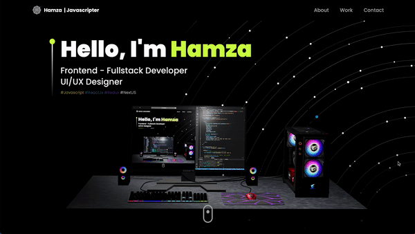

## Resume portfolio

### This project

Build to taste our habilities in React used my formation in field from developer to build my own portfolio!

## Features

- Components of React;  
- Components of ReactDOM;  
- Components of ReactIcons;  
- Componets of ThreeJS;  
- Modules of CSS;  
- Custom own hooks;  
- Conventional Commmits.  

### Live Version

<a href="http://resume.hamzaezzat.com">resume.hamzaezzat.com</a>

## Stack

- [`nextjs`](https://nextjs.org/) &ndash; React Framework for Production
- [`typescript`](https://www.typescriptlang.org/) &ndash; JavaScript with syntax for types
- [`tailwind`](https://tailwindcss.com/) &ndash; Utility-first CSS framework
- [`threejs`](https://github.com/mrdoob/three.js/) &ndash; Lightweight, 3D library with a default WebGL renderer
- [`@react-three/fiber`](https://github.com/pmndrs/react-three-fiber) &ndash; React renderer for Threejs on the web and react-native
- [`@react-three/drei`](https://github.com/pmndrs/drei) &ndash; Useful helpers for react-three-fiber
- [`@react-three/gltfjsx`](https://github.com/pmndrs/gltfjsx) &ndash; Turns GLTFs into JSX components
- [`@react-three/postprocessing`](https://github.com/pmndrs/react-postprocessing) &ndash; Postprocessing wrapper for react-three-fiber
- [`react-spring`](https://react-spring.dev/) &ndash; Javascript animation
